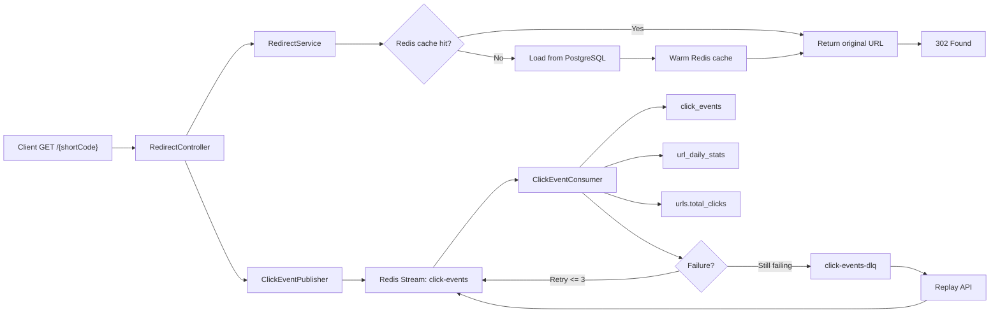

# ShortLink

ShortLink is a URL shortener backend built to demonstrate production-minded backend engineering with Spring Boot.

Current status: `Phase 2 completed`

## What Phase 2 Delivers

- Create short URLs with optional custom alias and expiration time
- Redirect short URLs with `302 Found`
- Redis-backed redirect cache with cache-aside flow
- Redis Streams click-event pipeline
- Async click persistence into `click_events`
- Daily aggregation into `url_daily_stats`
- Retry, DLQ, and replay flow for failed click events
- Unified JSON error handling
- Flyway-managed PostgreSQL schema

## Tech Stack

- Java 21
- Spring Boot 4
- Spring Web MVC
- Spring Data JPA
- Spring Data Redis
- PostgreSQL
- Redis
- Micrometer / Prometheus
- Flyway
- Maven
- Testcontainers

## Core API

### Create short URL

```bash
curl -i -X POST http://localhost:8080/api/v1/urls \
  -H "Content-Type: application/json" \
  -d '{
    "originalUrl": "https://example.com/landing-page"
  }'
```

### Redirect

```bash
curl -i http://localhost:8080/aB3xK7c
```

Expected:

```http
HTTP/1.1 302 Found
Location: https://example.com/landing-page
```

### Replay one DLQ click event

```bash
curl -i -X POST http://localhost:8080/api/v1/admin/click-events/dlq/<message-id>/replay
```

Expected:

```http
HTTP/1.1 202 Accepted
```

### List DLQ messages

```bash
curl -s http://localhost:8080/api/v1/admin/click-events/dlq
```

## Example Response

```json
{
  "id": "550e8400-e29b-41d4-a716-446655440000",
  "shortCode": "aB3xK7c",
  "shortUrl": "http://localhost:8080/aB3xK7c",
  "originalUrl": "https://example.com/landing-page",
  "totalClicks": 0,
  "expiresAt": null,
  "createdAt": "2026-03-27T08:00:00Z",
  "updatedAt": "2026-03-27T08:00:00Z"
}
```

## Error Format

```json
{
  "error": "INVALID_URL",
  "message": "Only http and https protocols are allowed",
  "status": 400,
  "timestamp": "2026-03-27T10:30:00Z",
  "path": "/api/v1/urls"
}
```

## Design Notes

- Random 7-character Base62 short codes
- `302` is used instead of `301` so every click still reaches the service
- URL validation blocks invalid schemes and private or local addresses
- A seeded user is used temporarily until authentication is added in Phase 3
- `open-in-view: false` keeps persistence logic inside service boundaries
- Structured JSON logging is configured with Logback
- Redirect stays synchronous, analytics stay asynchronous
- `url_daily_stats` is the authority for daily counts; `urls.total_clicks` is a read-optimized approximation

## Configuration

Common application settings live in `src/main/resources/application.yaml`.

The application uses environment-variable-first configuration for local development:

- `DB_URL`
- `DB_USERNAME`
- `DB_PASSWORD`
- `REDIS_HOST`
- `REDIS_PORT`
- `GEOIP_DB_PATH`

If these variables are not provided, local development defaults are used.

## GeoLite2 Setup

GeoIP enrichment is optional in Phase 2. If you do not configure a GeoLite2 database, the app still starts and click processing still works, but `country` and `city` stay empty.

To enable GeoIP locally:

1. Create a free MaxMind account and download the `GeoLite2 City` database.
2. Store the `.mmdb` file somewhere outside the repo or in a local-only folder such as `infra/geoip/GeoLite2-City.mmdb`.
3. Export the file path before starting the app:

```bash
export GEOIP_DB_PATH=/Users/your-name/path/to/GeoLite2-City.mmdb
./mvnw spring-boot:run
```

If `GEOIP_DB_PATH` is missing, points to a missing file, or the database cannot be opened, `GeoLookupService` logs a warning and gracefully disables GeoIP lookup.

## Phase 2 Architecture



## Phase 2 Validation

Key behaviors already covered in tests:

- Redis cache hit and miss behavior
- Redirect cache warm-up after cache miss
- Click pipeline end-to-end from redirect to DB persistence
- Strict daily unique counting by `urlId + UTC date + ipAddress`
- Retry 3 times before DLQ
- Replay from DLQ back into the main stream

Useful commands:

```bash
./mvnw -q -Dtest=RedisCacheIntegrationTest test
./mvnw -q -Dtest=ClickPipelineIntegrationTest test
./mvnw -q -Dtest=ClickEventDlqIntegrationTest test
./mvnw -q -Dtest=ClickEventReplayIntegrationTest test
```

These integration tests use Testcontainers, so Docker must be running.

## Metrics

Phase 2 currently exposes these key metrics through `/actuator/prometheus`:

- `shortlink_cache_hits_total`
- `shortlink_cache_misses_total`
- `shortlink_click_events_dropped_total`
- `shortlink_consumer_lag`
- `shortlink_dlq_size`

## Run Locally

Make sure PostgreSQL and Redis are running locally, then start the app:

```bash
./mvnw spring-boot:run
```

Run tests with:

```bash
./mvnw -U test
```

Integration tests use Testcontainers with PostgreSQL and Redis, so Docker must be running before executing the full test suite.
