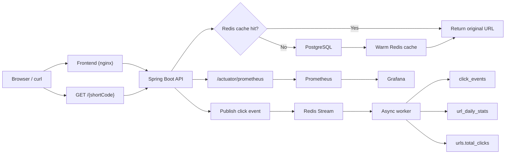

# ShortLink

ShortLink is a self-hosted URL shortener with JWT auth, Redis-backed redirect caching, and async click analytics.

## Quick Start

The fastest reviewer path is:

```bash
cp .env.example .env
docker compose up -d
./smoke-test.sh
```

If port `3000`, `3001`, `8080`, or `9090` is already in use on your machine, edit `.env` first and change:

- `FRONTEND_PORT`
- `GRAFANA_PORT`
- `APP_PORT`
- `PROMETHEUS_PORT`

If you change `APP_PORT`, also change `APP_BASE_URL` to match it.

After startup, the main entry points are:

- App API: `http://localhost:${APP_PORT}`
- Frontend: `http://localhost:${FRONTEND_PORT}`
- Prometheus: `http://localhost:${PROMETHEUS_PORT}`
- Grafana: `http://localhost:${GRAFANA_PORT}` with `admin/admin` by default

The smoke test seeds this reviewer account:

- Email: `demo@shortlink.local`
- Password: `SecurePass1`

## Reviewer Flow

`./smoke-test.sh` verifies the flow below end-to-end:

1. Wait for `GET /actuator/health` to report `UP`
2. Load `seed.sql` into PostgreSQL
3. Verify a seeded public redirect returns `302`
4. Log in as the demo user
5. Create a new short URL through the authenticated API
6. Hit the short URL twice as two different visitors
7. Poll analytics until async click processing updates daily stats

## Architecture



## Core API Walkthrough

### Login

```bash
curl -sS -X POST http://localhost:8080/api/v1/auth/login \
  -H "Content-Type: application/json" \
  -d '{
    "email": "demo@shortlink.local",
    "password": "SecurePass1"
  }'
```

### Create a short URL

```bash
curl -sS -X POST http://localhost:8080/api/v1/urls \
  -H "Authorization: Bearer <access-token>" \
  -H "Content-Type: application/json" \
  -d '{
    "originalUrl": "https://example.com/landing-page",
    "customAlias": "launch-demo"
  }'
```

Example response:

```json
{
  "id": "550e8400-e29b-41d4-a716-446655440000",
  "shortCode": "launch-demo",
  "shortUrl": "http://localhost:8080/launch-demo",
  "originalUrl": "https://example.com/landing-page",
  "totalClicks": 0,
  "expiresAt": null,
  "createdAt": "2026-04-07T10:00:00Z",
  "updatedAt": "2026-04-07T10:00:00Z"
}
```

### Redirect

```bash
curl -i http://localhost:8080/launch-demo
```

Expected:

```http
HTTP/1.1 302 Found
Location: https://example.com/landing-page
```

### Analytics

```bash
curl -sS "http://localhost:8080/api/v1/urls/launch-demo/analytics?from=2026-04-07&to=2026-04-07" \
  -H "Authorization: Bearer <access-token>"
```

Example response:

```json
{
  "shortCode": "launch-demo",
  "totalClicks": 2,
  "periodClicks": 2,
  "uniqueClicks": 2,
  "clicksByDate": [
    {
      "date": "2026-04-07",
      "clicks": 2
    }
  ]
}
```

## Design Decisions

- Redirects use `302 Found` instead of `301` so every click still reaches the service and can be measured.
- Short-code generation uses random Base62 codes with collision checks rather than a central counter.
- Redirect and analytics are split: redirect stays fast and synchronous, analytics happens asynchronously through Redis Streams.
- Daily analytics are served from `url_daily_stats`, while `urls.total_clicks` is kept as a read-optimized aggregate.
- Reviewer setup is based on Docker Compose plus an executable smoke test, not on manual local service wiring.

## Current Capabilities

- Email/password registration and login
- JWT access tokens plus refresh token rotation
- Per-user create, list, detail, delete, and analytics APIs
- Public short-link redirect with Redis cache-aside reads
- Async click ingestion into Redis Streams
- Click persistence, daily aggregation, DLQ, and replay support
- Prometheus metrics and Grafana container wiring
- Dockerized backend and frontend images

## Configuration

The main local environment knobs live in `.env.example`.

Important ones:

- `APP_PORT`
- `FRONTEND_PORT`
- `PROMETHEUS_PORT`
- `GRAFANA_PORT`
- `APP_BASE_URL`
- `JWT_SECRET`
- `CORS_ALLOWED_ORIGINS`
- `GEOIP_DB_PATH`

`postgres` and `redis` are intentionally not published to host ports in `docker-compose.yml`. They stay internal to the demo stack unless you choose to expose them yourself.

## GeoLite2 Setup

GeoIP enrichment is optional. If `GEOIP_DB_PATH` is empty or invalid, redirects and analytics still work, but `country` and `city` enrichment stay empty.

To enable GeoIP locally:

1. Create a free MaxMind account and download the `GeoLite2 City` database.
2. Store the `.mmdb` file outside the repo or in a local-only folder such as `infra/geoip/GeoLite2-City.mmdb`.
3. Put the absolute path into `GEOIP_DB_PATH` in `.env`.

## Metrics

The app exposes Prometheus metrics at `/actuator/prometheus`.

Examples already wired in the backend:

- `shortlink_cache_hits_total`
- `shortlink_cache_misses_total`
- `shortlink_click_events_dropped_total`
- `shortlink_consumer_lag`
- `shortlink_dlq_size`

Grafana is included in the Compose stack now so the observability surface is runnable locally. Dashboard JSON and benchmark evidence belong to the next phase.

## Known Limitations

- Refresh token rotation does not yet implement token-family reuse detection.
- Grafana dashboards and k6 benchmark artifacts are not yet committed in this phase.
- If you change published ports in `.env`, remember that URLs shown in API responses depend on `APP_BASE_URL`.
