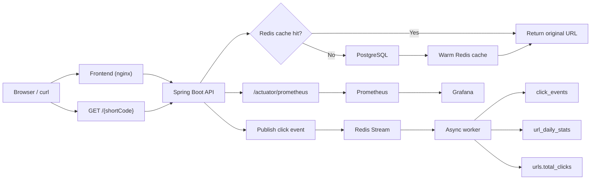

# ShortLink

ShortLink is a self-hosted URL shortener built with Spring Boot, React, PostgreSQL, and Redis. It focuses on fast redirects, async analytics, rate limiting, and observable local operation.

## Tech Stack

| Layer | Stack |
|---|---|
| Backend | Java 21, Spring Boot 4, Spring Security, Spring Data JPA, Flyway |
| Frontend | React 18, TypeScript, Vite, Tailwind CSS, Recharts |
| Data | PostgreSQL 16, Redis 7, Redis Streams |
| Observability | Prometheus, Grafana, Micrometer |
| Verification | Docker Compose, k6, Testcontainers, Vitest |

## Prerequisites

Before running the demo flow, make sure you have:

- Docker Desktop or Docker Engine with Compose V2
- `curl`
- `jq`
- `k6` if you want to reproduce the load-test and failover evidence

## Quick Start

The fastest local path is:

```bash
cp .env.example .env
docker compose up -d --build
./smoke-test.sh
```

To reset all local data and start from a clean state, run:

```bash
docker compose down -v
docker compose up -d --build
./smoke-test.sh
```

If port `3000`, `3001`, `8080`, or `9090` is already in use on your machine, edit `.env` first and change:

- `FRONTEND_PORT`
- `GRAFANA_PORT`
- `APP_PORT`
- `PROMETHEUS_PORT`

If you change `APP_PORT`, also change `APP_BASE_URL` to match it.

After startup, the main entry points are:

- App API: `http://localhost:${APP_PORT}`
- Frontend: `http://localhost:${FRONTEND_PORT}`
- Prometheus: `http://localhost:${PROMETHEUS_PORT}`
- Grafana: `http://localhost:${GRAFANA_PORT}` with `admin/admin` by default, already provisioned with a Prometheus datasource

Architecture note:

- The frontend SPA lives on `FRONTEND_PORT`
- Public redirects such as `/{shortCode}` and the REST API both live on `APP_PORT`
- Example: `http://localhost:3000` serves the UI, while `http://localhost:8080/demo-home` is a redirect entry point

The smoke test seeds this demo account:

- Email: `demo@shortlink.local`
- Password: `SecurePass1`

## Smoke Test Flow

`./smoke-test.sh` verifies the flow below end-to-end:

1. Wait for `GET /actuator/health` to report `UP`
2. Load `seed.sql` into PostgreSQL
3. Verify a seeded public redirect returns `302`
4. Log in as the demo user
5. Create a new short URL through the authenticated API
6. Hit the short URL twice as two different visitors
7. Poll analytics until async click processing updates daily stats

Each smoke-test run creates one new `smoke-*` short link so the verification remains visible in the UI and API afterward.

## Architecture



## Measured Results

Design target for the hot cache-hit redirect path: `p99 < 5ms`.

The measurements below were taken on the local Docker Compose stack on macOS. They are useful as comparative evidence for this repository, not as universal SLAs for every machine.

| Area | Scenario | Result | Notes |
|---|---|---|---|
| Redirect latency | `k6` hotspot redirect, `200 VUs / 15s` | `p50 13.88ms`, `p95 49.97ms`, `p99 78.36ms` | End-to-end timing includes rate limiting, Redis access, and local Docker networking overhead |
| Redirect throughput | `k6` hotspot redirect, `200 VUs / 15s` | `~11.8k req/s` | 100% `302` success rate during the run |
| Cache-hit baseline | `k6` hotspot redirect, `2 VUs / 2s` | `p99 4.36ms` | Shows the cache-hit path itself is fast under minimal contention; the larger gap appears under concurrent load |
| Management rate limiting | `k6` management mix, `50 VUs / 15s` | `429` triggered as expected | Earlier run showed about `89.75%` requests rate-limited under overload |
| Redis failover | Redirect traffic during `stop redis -> start redis` drill | Redirect success stayed at `100%` during outage and recovery | Analytics events may be dropped during degradation by design |

Observed bottlenecks and follow-ups:

- The public redirect path still pays a Redis round trip for rate limiting on every request, which protects abuse but adds tail latency.
- Redirect latency is measured end-to-end now, so the current p99 reflects the real request path instead of a narrower controller-only slice.
- A selective rollback from async click-event publishing back to synchronous publishing regressed to about `95.98ms` p99 with lower throughput, so the async path was kept.

## Core API Walkthrough

For the examples below, set your API base first. If you changed `APP_PORT`, update this value to match:

```bash
APP=http://localhost:8080
```

### Register

```bash
curl -sS -X POST "$APP/api/v1/auth/register" \
  -H "Content-Type: application/json" \
  -d '{
    "email": "alice@example.com",
    "password": "SecurePass1",
    "name": "Alice"
  }'
```

### Login

Use the demo account from `./smoke-test.sh`, or log in with the account you just registered:

```bash
curl -sS -X POST "$APP/api/v1/auth/login" \
  -H "Content-Type: application/json" \
  -d '{
    "email": "alice@example.com",
    "password": "SecurePass1"
  }'
```

### Create a short URL

```bash
curl -sS -X POST "$APP/api/v1/urls" \
  -H "Authorization: Bearer <access-token>" \
  -H "Content-Type: application/json" \
  -d '{
    "originalUrl": "https://example.com/landing-page",
    "customAlias": "launch-demo"
  }'
```

Example response:

```json
{
  "id": "550e8400-e29b-41d4-a716-446655440000",
  "shortCode": "launch-demo",
  "shortUrl": "http://localhost:8080/launch-demo",
  "originalUrl": "https://example.com/landing-page",
  "totalClicks": 0,
  "expiresAt": null,
  "createdAt": "2026-04-07T10:00:00Z",
  "updatedAt": "2026-04-07T10:00:00Z"
}
```

### Redirect

```bash
curl -i "$APP/launch-demo"
```

Expected:

```http
HTTP/1.1 302 Found
Location: https://example.com/landing-page
```

### Analytics

Replace the date range with today in UTC or with the period that covers your redirect traffic:

```bash
TODAY=$(date -u +%F)
```

```bash
curl -sS "$APP/api/v1/urls/launch-demo/analytics?from=$TODAY&to=$TODAY" \
  -H "Authorization: Bearer <access-token>"
```

Example response:

```json
{
  "shortCode": "launch-demo",
  "totalClicks": 2,
  "periodClicks": 2,
  "uniqueClicks": 2,
  "clicksByDate": [
    {
      "date": "2026-04-07",
      "clicks": 2
    }
  ]
}
```

### Delete

```bash
curl -i -X DELETE "$APP/api/v1/urls/launch-demo" \
  -H "Authorization: Bearer <access-token>"
```

Expected:

```http
HTTP/1.1 204 No Content
```

## Design Decisions

- Redirects use `302 Found` instead of `301` so every click still reaches the service and can be measured.
- Short-code generation uses random Base62 codes with collision checks rather than a central counter.
- Redirect and analytics are split: redirect stays fast and synchronous, analytics happens asynchronously through Redis Streams.
- Daily analytics are served from `url_daily_stats`, while `urls.total_clicks` is kept as a read-optimized aggregate.
- Local setup is based on Docker Compose plus an executable smoke test, not on manual service wiring.

### Performance Tradeoffs

- Redirect latency metrics are measured end-to-end now, including the real request path rather than only controller-local time.
- Public redirect rate limiting stays enabled on purpose. It adds overhead, but removing it would improve numbers by weakening abuse protection.
- Click analytics are treated as lower priority than redirect availability. Under overload or Redis trouble, the system may drop analytics events rather than block redirects.
- We benchmarked a selective rollback from async click-event publishing back to synchronous publishing. That variant regressed to about `95.98ms` p99 and lower throughput than the current build, so the async path was kept.

## Current Capabilities

- Email/password registration and login
- JWT access tokens plus refresh token rotation
- Per-user create, list, detail, delete, and analytics APIs
- Public short-link redirect with Redis cache-aside reads
- Async click ingestion into Redis Streams
- Click persistence, daily aggregation, DLQ, and replay support
- Prometheus metrics, core alert rules, and provisioned Grafana dashboards
- `k6` load tests for redirect and management traffic
- Redis failover drill scripts for local resilience verification
- Dockerized backend and frontend images

## Configuration

The main local environment knobs live in `.env.example`.

Important ones:

- `APP_PORT`
- `FRONTEND_PORT`
- `PROMETHEUS_PORT`
- `GRAFANA_PORT`
- `APP_BASE_URL`
- `JWT_SECRET`
- `CORS_ALLOWED_ORIGINS`
- `GEOIP_DB_PATH`

PostgreSQL and Redis stay internal to the Compose network by default. Publish them only if you need direct host-side debugging.

## GeoLite2 Setup

GeoIP enrichment is optional. If `GEOIP_DB_PATH` is empty or invalid, redirects and analytics still work, but `country` and `city` enrichment stay empty.

To enable GeoIP locally:

1. Create a free MaxMind account and download the `GeoLite2 City` database.
2. Store the `.mmdb` file outside the repo or in a local-only folder such as `infra/geoip/GeoLite2-City.mmdb`.
3. Put the absolute path into `GEOIP_DB_PATH` in `.env`.

## Metrics

The app exposes Prometheus metrics at `/actuator/prometheus`.

Examples already wired in the backend:

- `shortlink_redirect_latency_seconds`
- `shortlink_redirects_total`
- `shortlink_cache_hits_total`
- `shortlink_cache_misses_total`
- `shortlink_dropped_events_total`
- `shortlink_rate_limited_total`
- `shortlink_consumer_lag`
- `shortlink_dlq_size`

Grafana is included in the Compose stack and auto-provisioned. The two core local review dashboards are:

- `Redirect Performance`
- `Reliability Protection`

Prometheus also loads a focused alert set for redirect latency, redirect 5xx ratio, DB connection pressure, consumer lag, DLQ growth, and dropped analytics events.

## Benchmark And Drill Commands

The quickest way to reproduce the main benchmark and failover evidence locally is:

```bash
docker compose up -d --build
./smoke-test.sh
k6 run infra/k6/redirect-load.js
k6 run infra/k6/management-load.js
BASE_URL=http://localhost:8080 bash infra/k6/fault-inject.sh
```

If your local ports differ, export `BASE_URL`, `APP_PORT`, `PROMETHEUS_PORT`, and `GRAFANA_PORT` accordingly before running the commands above. Running `./smoke-test.sh` first is useful because it seeds a known-good demo user and verifies the stack is healthy before you benchmark it.

## Run Tests Locally

Backend tests:

```bash
cd backend
./mvnw test
```

The backend test suite covers utility and service logic plus integration paths for auth, CRUD, redirect flow, Redis cache behavior, click pipeline, rate limiting, DLQ/replay, analytics, and Redis degradation.

Frontend tests:

```bash
cd frontend
npm test
```

The frontend tests cover auth flow, link creation/history interactions, analytics rendering, and shared test helpers.

Backend integration tests use Testcontainers, so Docker must be running before you execute the full backend suite.

## Known Limitations

- Refresh token rotation does not yet implement token-family reuse detection.
- Benchmark numbers are local-machine evidence, not cloud-grade production guarantees.
- Under overload or Redis trouble, analytics completeness is intentionally traded for redirect availability.
- If you change published ports in `.env`, remember that URLs shown in API responses depend on `APP_BASE_URL`.
